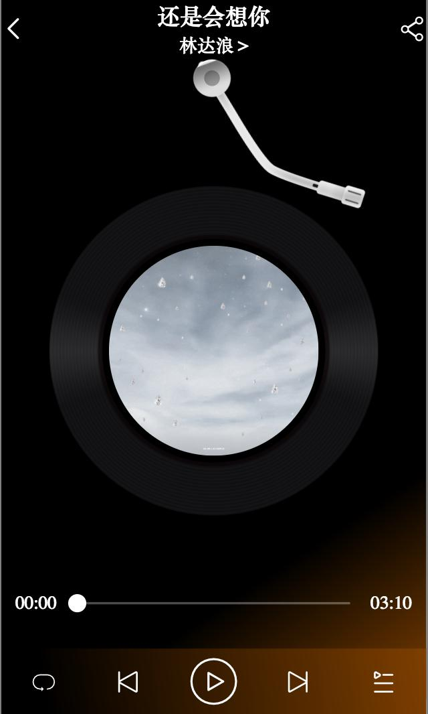

# Uni-NetEaseCloudMusic

##使用uni-app开发的仿网易云音乐

 **介绍** 
该项目在原有的基础上使用uni-app升级，代码封装性，更强，更简洁，扩展性更好，且在原有的功能扩展更多模块功能，添加过度动画，优化图片加载等等。

 **软件架构** 
仿网易云音乐使用的是基于vue的uni-app框架，语法使用的的javascript和css

 **安装教程** 
1.  下载仓库代码
2.  下载uni-app框架，可将代码运行小程序端，手机app端口。
3.  可使用uni-app打包成小程序或app。

 **使用说明** 

1.  app使用的api接口是基于开源的Github开发者的接口，仅供学习使用。
2.  后端接口文档地址 
3.  后端接口地址 http://musicapi.leanapp.cn
3.  本项目后端使用的接口为开源接口 http://musicapi.leanapp.cn 如需要修改后端接口地址，
可以前往  文档地址下载后端文件，
以及Vercel 官网进行部署

4.  本程序使用的全局背景音乐API只限于小程序或安卓，无法兼容H5浏览器
5.  小程序若需要在后台播放可以在后 manifest.json 源代码中（ 如微信模块配置 "mp-weixin" ）添加以下属性
	"requiredBackgroundModes": [
	    "audio",
	    "location"
	],
5.  已知问题：
（1）由于app与小程序端存在差异运行可能app本地图片无法加载，可更改组件中图片的相对路径即可。
（2）app和小程序平台不同，获取元素节点宽度存在差异，目前能在小程序稳定运行，app中播放页面可能无法拖拽音乐进度条。
 (3) 由于后台接口的问题，建议从 接口地址 http://musicapi.leanapp.cn 获取后台源码运行在自己的服务器上，直接调用开源接口
  可能会导致无法获取歌曲url。
（4）目前由于uni存在平台的差异，目前只对微信小程序做了兼容处理，未作条件编译。（其他的平台可能存在BUG）
    

 **参与贡献** 

1.  Ui设计风格与网易云音乐v7.3.8风格相似
2.  接口提供者 Binaryify 开源接口地址 https://binaryify.github.io/NeteaseCloudMusicApi/#/?id=neteasecloudmusicapi
3.  作者阿里云75提交代码

 **功能模块** 

1.网易手机登录

   （1）手机登录

   （2）一键登陆

   （3）验证码登录

2.我的音乐

   （1）创建，收藏歌单

   （2）用户面板

3.网易首页

   （1）推荐歌单，排行榜,热门电台

   （2）每日歌曲

   （3）小播放器联动

4.播放器内核

   （1）歌曲详情

   （2）进度条拖拽

   （3）随机播放，列表循环，单曲播放

   （4）暂停，下一曲，上一曲

   （5）单曲，每日推荐，歌单，专辑等播放

5.搜索功能

   （1）单曲搜素

   （2）歌单搜素
   

6.个人中心

   （1）创建与收藏歌单

   （2）个人基本信息

 **功能展示图** 
 
 
 
 
 
 
 
 
 
 
 
 
 
 
 
